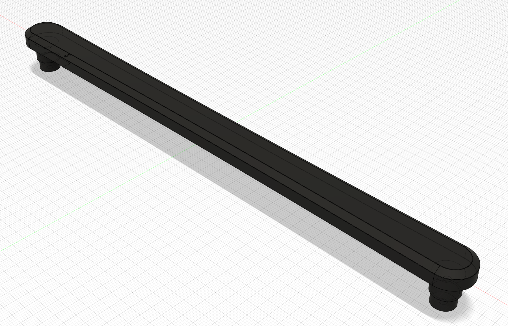

# Oven Handle

## Files

### Revision 0

| File | Notes |
| ---- | ----- |
| [`CCR6SE_Oven Handle v0.3mf`](files/CCR6SE_Oven%20Handle%20v0.3mf) | Ultimaker Cura 5.2 |
| [`CCR6SE_Oven Handle v0.gcode`](files/CCR6SE_Oven%20Handle%20v0.gcode) | Creality CR-6 SE (3D Printer) |

### Revision 1

| File | Notes |
| ---- | ----- |
| [`Oven+Handle+v1.skp`](files/Oven+Handle+v1.skp) | SketchUp 2020 |
| [`CCR6SE_Oven Handle v1.3mf`](files/CCR6SE_Oven%20Handle%20v1.3mf) | Ultimaker Cura 5.2 |
| [`CCR6SE_Oven Handle v1.gcode`](files/CCR6SE_Oven%20Handle%20v1.gcode) | Creality CR-6 SE (3D Printer)) |

### Revision 2 (Final)

| File | Notes |
| ---- | ----- |
| [`Oven+Handle+v2.skp`](files/Oven+Handle+v2.skp) | SketchUp 2020 |
| [`CCR6SE_Oven Handle v2.3mf`](files/CCR6SE_Oven%20Handle%20v2.3mf) | Ultimaker Cura 5.2 |
| [`CCR6SE_Oven Handle v2.gcode`](files/CCR6SE_Oven%20Handle%20v2.gcode) | Creality CR-6 SE (3D Printer) |

## Software

- [Ultimaker Cura](https://ultimaker.com/software/ultimaker-cura)
- [SketchUp](https://www.sketchup.com/try-sketchup)